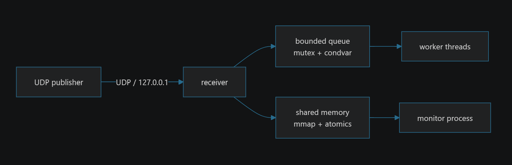

# PulseForge

A small but serious **C++ learning codebase**: a miniature low-latency
market-data pipeline and debugging lab. Built for **educational purposes
only** - this is **not** production trading software.

- **Language:** C++17 (`std::atomic`, `std::thread`, `std::mutex`,
  `std::condition_variable`, RAII)
- **Platform:** Linux / POSIX (sockets, pthreads, mmap, fork, epoll)
- **Build:** `g++` + `make` only, no external libraries
- **Warnings are errors:** `-Wall -Wextra -Wpedantic -Werror`

> Running on Windows? Use **WSL (Ubuntu)** - every API used here is
> available inside WSL2.

## Architecture



**Phase 1 (current)** is the full pipeline above, built from four
moving parts:

1. **UDP publisher** (`bin/publisher`) - synthesizes fixed-size
   `TickMessage`s (a 40-byte struct: sequence, send timestamp, symbol,
   price, quantity, flags) and sends them over UDP on `127.0.0.1`. It
   paces to a target rate (best effort), can deliberately *skip* every
   Nth sequence (`--drop-every`) to simulate packet loss, and can send
   in bursts (`--burst`) within each pacing step.

2. **UDP receiver** (`bin/receiver`) - binds the loopback socket
   (`SO_REUSEADDR` + a 4 MiB `SO_RCVBUF`; the kernel socket buffer acts
   as the *first* queue ahead of the bounded one). It validates each
   datagram (exact 40-byte size, then `message_is_valid()`: nonzero
   quantity, known flag bits), detects **sequence gaps** and **reorders**
   against the last-seen sequence, then enqueues the tick into a bounded
   queue with backpressure.

3. **Bounded queue + workers** - a mutex + two-condition-variable FIFO
   (capacity 4096, MPSC-safe). The receiver is the single producer; N
   worker threads (`--workers`) are the consumers. Workers fold each
   message into the shared statistics (processed count, latency
   total/max, queue-depth gauge) and may be throttled with
   `--slow-consumer-us` as fault injection. Shutdown is a clean
   "close the queue -> drain remaining items -> join workers" sequence.

4. **Shared-memory monitor** (`bin/monitor`) - a *separate process* that
   opens the stats region (`shm_open` + `mmap MAP_SHARED`) and renders a
   live dashboard once per second. The receiver is the **owner**
   (creates and unlinks the object); the monitor is a guest
   (open/close only, never unlinks).

Cross-cutting Phase 1 concerns:

- Every counter that crosses threads or processes is a C++17
  `std::atomic<uint64_t>`. Receiver-written and worker-written counters
  are padded onto separate cache lines to avoid **false sharing**, and a
  runtime check verifies the atomics are truly lock-free on this
  platform.
- Signal handling deliberately omits `SA_RESTART` so a blocking
  `recvfrom()` is interrupted (returns `EINTR`), letting the receiver
  observe `Ctrl-C` and shut down cleanly instead of spinning or hanging.
- All sockets, threads, and shared-memory resources are owned by RAII
  wrappers (`Socket`, `SharedStatsRegion`, `std::thread`, `QueueMutex`)
  from `common.hpp`/`shared_stats.hpp`. `CHECK()` throws a `SystemError`
  on syscall failure; a top-level `catch` in `main()` reports it and
  returns an exit code. Stack unwinding runs the destructors, so every
  exit path cleans up - no `goto cleanup` needed.

## Prerequisites

```sh
sudo apt update && sudo apt install -y build-essential
# optional, for later phases: valgrind
```

Verify:

```sh
g++ --version   # 12+ recommended (C++17 support)
make --version
```

## Build

```sh
make          # release build -> bin/publisher, bin/receiver, bin/monitor
make debug    # -O0 -g3 with assertions
make test     # build and run the unit tests
make clean
```

> Tip: if you switch between `make`, `make asan`, `make tsan`, run
> `make clean` first so stale objects are not reused.

## Run (three terminals)

Terminal A - receiver (mutex queue, one worker):

```sh
./bin/receiver --port 9000 --queue mutex --workers 1
```

Terminal B - monitor (separate process, refreshes every second):

```sh
./bin/monitor --shared-memory-name /pulseforge_stats
```

Terminal C - publisher (10,000 ticks, dropping every 7th):

```sh
./bin/publisher --port 9000 --rate 10000 --count 10000 --drop-every 7
```

Stop the receiver and monitor with `Ctrl-C`.

There is also a one-shot script that runs all three:

```sh
bash scripts/run_basic.sh
```

### Expected output (from a real run)

Receiver:

```
PulseForge receiver (queue=mutex, workers=1, shm=/pulseforge_stats)
  listening on 127.0.0.1:9000  (Ctrl-C to stop)

Closing queue; draining 1 worker(s)...
  worker 0: processed 8572  avg latency NNN ns  max latency NNN ns
Receiver summary:
  received    8572
  invalid     0
  gaps        1428
  reorders    0
  queue full  0
  processed   8572
  avg latency X.X us   max latency Y.Y us
  runtime     X.XXX s
```

Monitor (one dashboard frame):

```
PulseForge monitor  [shm /pulseforge_stats]  (Ctrl-C to exit)

  received        8572   (+8572/s)
  invalid            0
  gaps            1428
  reorders           0
  queue full         0
  queue depth        0
  processed       8572   (+8572/s)
  avg latency      X.X us
  max latency     Y.Y us
```

(`10000 / 7` sequences are intentionally dropped, so gaps = 1428.
Latency/timing numbers vary per run.)

## Publisher options

```sh
./bin/publisher --port 9000 --rate 100000 --count 1000000 \
                --symbol 7 --drop-every 0 --burst 16
```

| Option | Meaning |
|---|---|
| `--port PORT` | UDP destination port |
| `--rate MPS` | average messages/second (best effort) |
| `--count N` | sequence numbers to generate |
| `--symbol ID` | synthetic symbol id in each tick |
| `--drop-every N` | skip every Nth sequence (simulates loss; `0` = off) |
| `--burst SIZE` | datagrams sent per pacing step |

## Receiver options

```sh
./bin/receiver --port 9000 --queue mutex --workers 2 \
               --pin-cpu 2 --slow-consumer-us 200 \
               --shared-memory-name /pulseforge_stats
```

| Option | Meaning |
|---|---|
| `--port PORT` | UDP port to bind |
| `--queue mutex\|spsc` | queue backend (`mutex` now; `spsc` in Phase 4) |
| `--workers N` | consumer threads (default 1) |
| `--pin-cpu CPU` | pin the receiver thread to a CPU |
| `--slow-consumer-us US` | artificial worker delay per msg (fault injection) |
| `--shared-memory-name NAME` | shm object (default `/pulseforge_stats`) |

## Monitor options

```sh
./bin/monitor --shared-memory-name /pulseforge_stats
```

## Sanitizer builds

```sh
make asan   # AddressSanitizer build
make tsan   # ThreadSanitizer build (useful from Phase 3 on)
```

## What is next

- **Phase 3:** deadlock and data-race labs, ASan/TSan/Helgrind targets,
  debugging documentation.
- **Phase 4:** C++17-atomic lock-free SPSC ring, memory-ordering notes,
  queue comparison scripts.
- **Phase 5:** Disruptor-style fan-out, epoll/eventfd/timerfd,
  CPU-affinity and `perf` exercises.
- **Phase 6 (on request):** huge pages, mlockall, eBPF, DPDK concepts.

## Warning

This is a **learning lab**, not production trading software. It
deliberately contains simplified design, synthetic data, and (in later
phases) opt-in demonstrations of bugs for debugging practice. Never use
it to handle real money or real market data.
